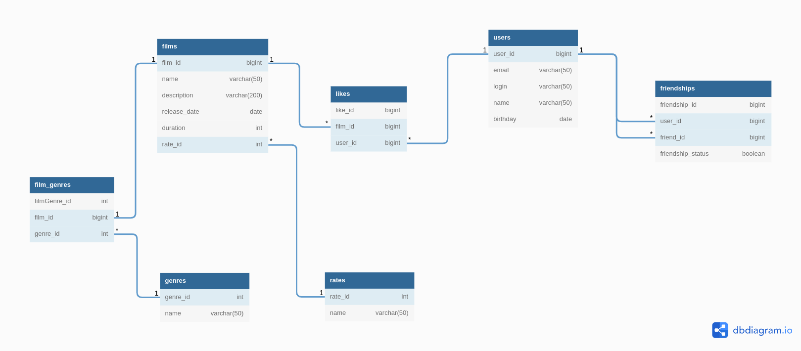

# Учебное приложение "Online кинотеатр "Filmorate"

1. Добавление, обновление и получение информации о пользователях и фильмах
2. Хранение информации в базе данных
3. Валидация сведений о пользователях и фильмах
4. Логирование
5. Тестирование
6. Стек технологий: Java, SpringBoot, Lombok

### Пример кода:

```
@PutMapping("/films/{id}/like/{userId}")
    public void addLike(@PathVariable long id, @PathVariable Long userId) {
        if (id <= 0 || userId <= 0) {
            writeLogAndThrowValidationException();
        }
        filmService.addLike(id, userId);
    }
```

### ER диаграмма



### Пояснение к ER диаграмме

Таблица genre содержит список жанров фильма.
У фильма может быть несколько жанров.

Таблица rating содержит перечень возрастных ограничений
фильма в соответствии с рейтингом Ассоциации кинокомпаний (МРА).

Таблица friendship определяет статус «дружба» между двумя пользователями.

### Примеры запросов для основных операций приложения:

Получение всех фильмов:

SELECT film_id
FROM films;  

Получение всех пользователей:

SELECT user_id
FROM users;

Получение ТОП-5 наиболее популярных фильмов:

SELECT film_id
FROM(
SELECT film_id, COUNT(user_id) AS c
FROM likes
GROUP BY film_id
ORDER BY c DESC
LIMIT 5) AS a;